<p  align="center">
    <br>Compiladores  2027- <br>
  Práctica 1: Analizadores léxicos con Lex (Flex) <br> Profesora: Ariel Adara Mercado Martínez
</p>

## Análisis léxico con Flex
### Objetivo:
Que el alumno conozca y utilice los principios para generar analizadores léxicos utilizando Lex.

### Introducción
Lex es una herramienta para generar analizadores léxicos, que se deben describir mediante las expresiones regulares de los tokens que serán reconocidas por el analizador léxico (scanner o lexer). Originalmente fue desarrollado para el sistema operativo Unix, pero con la popularidad de Linux se creo una versión para este sistema llamada Flex.

#### Estructura de un archivo Lex
Un programa en LEX consta de tres secciones:
```
Seccion de declaraciones
%%
Sección de expresiones regulares
%%
Sección de código de usuario (código en lenguaje C++)
```

#### Sección de declaraciones
* __Directivas de código c++.__ Se utilizan para incluir los archivos de biblioteca y definir las variables globales es la siguiente:
```lex
%{
  #include <iostream>
  int contador;
%}
```
* __Macros o definiciones.__ Las macros son variables a las que se les asignar una expresión regular. P. ej. ```letra [a-zA-Z]```, la macro
se llama _letra_, separada por un espacio de la definición de su expresión regular.
* __Directivas de Lex__. Las directivas u opciones de escáner le indican a Lex que realice tareas extras al momento de generar el analizador léxico.
    * ```%option yylineno``` genera un contador de lı́neas automáticamente.
    * ```%option noyywrap``` le indica a lex que debe generar de forma automática la función yywrap.
    * ```%x``` o ```%s``` es para declarar estados léxicos.

#### Sección de expresiones regulares
* __Estructura__:
```Expresión Regular (espacio, nunca salto de lı́nea) {Acción Léxica} ```
   * __Expresión Regular__: debe estar escrita con la sintaxis de Lex
   * __Acción Léxica__: se ejecuta cada vez que se encuentra una cadena que coincida con la expresión regular y es escrita
en lenguaje C++, encerrada por llaves.

#### Metacaracteres

| Caracter | Descripción |
|----------|-------------|
|c         |Cualquier carácter representado por c que no sea un operador|
|\c        |El carácter c literalmente|
|"S"       |La cadena s, literalmente|
|.         |Cualquier carácter excepto el salto de lı́nea|
|∧         |Inicio de línea|
|$         |Fin de lı́nea|
|[s]       |Cualquier carácter incluido dentro de la cadena s|
|[^s]      |Cualquier carácter que no esté dentro de s|
|\n        |Salto de lı́nea|
|*         |Cerradura de Kleene|
|+         |Cerradura positiva|
|\|        |Disyunción|
|?         |Cero o una instancia|
|{m, n}    |Entre m y n instancias de una expresión que le antecede


#### Sección de código de usuario
En esta sección se escriben las funciones auxiliares para realizar el análisis léxico, por lo general es donde se agrega a
main.

## Primer programa en Flex++

### Instalación de flex
* Para Debian o Ubuntu: ```sudo apt-get install flex```
* Para Suse u OpenSuse: ```sudo zypper in flex```
### Para comprobar que se ha instalado correctamente:
```flex −−version```
### Primer programa en lex


```C++ 
%{
  #include <iostream>
%}

%option c++
%option noyywrap


digito [0-9]
letra [a-zA-Z]
palabra {letra}+
espacio [ \t\n]

%%

{espacio} {/* La acción léxica puede ir vacía si queremos que el escáner ignore la regla*/}
{digito}+ { std::cout << "Encontré un número: " << yytext << std::endl; }
{palabra} { std::cout << "Encontré una palabra: " << yytext << std::endl; }

%%


int main() {
  FlexLexer* lexer = new yyFlexLexer;
  lexer->yylex();
}

```

#### Pasos
a. Transcribir el código anterior a un archivo con extensión .ll, .lex o .flex dentro de la carpeta *src/__Primer programa en Lex__/* <br>
b. Compilar mediante la instrucción: ```flex++ archivo.ll``` <br>
c. Comprobar se genero el archivo _lex.yy.cc_ <br>
d. Compilar mediante: ```g++ lex.yy.cc -o nombreEjecutable``` <br>
e. Ejecutar mediante: ```./nombreEjecutable```

#### Ejercicios 
1. ¿Qué ocurre si en la primera sección se quitan las llaves al nombre de la macro letra? (0.5 pts)

    Para probarlo cambié en _archivo.ll_ la macro `palabra {letra}+` por `palabra letra+`. El programa compila sin errores, pero la macro cambia de significado: Flex ya no interpreta `letra` como una macro sino como los caracteres literales `l`, `e`, `t`, `r`, `a`, y el `+` solo afecta a la última `a`. Es decir, `palabra` ahora solo reconoce cadenas como `letra`, `letraa`, `letraaa`, etc.

    En la imagen se ve este comportamiento (cada línea que escribí aparece seguida de lo que imprimió el programa): al escribir `letra` sí se reporta `Encontré una palabra: letra`, y al escribir `letraletra` se reportan dos palabras `letra`, porque la cadena literal aparece dos veces seguidas. En cambio, al escribir `abc` ya no aparece ningún mensaje, solo se vuelve a imprimir `abc` tal cual: como ya no coincide con ninguna regla, Flex aplica su regla por defecto, que copia el texto a la salida (lo mismo que se explica en la pregunta 6).

    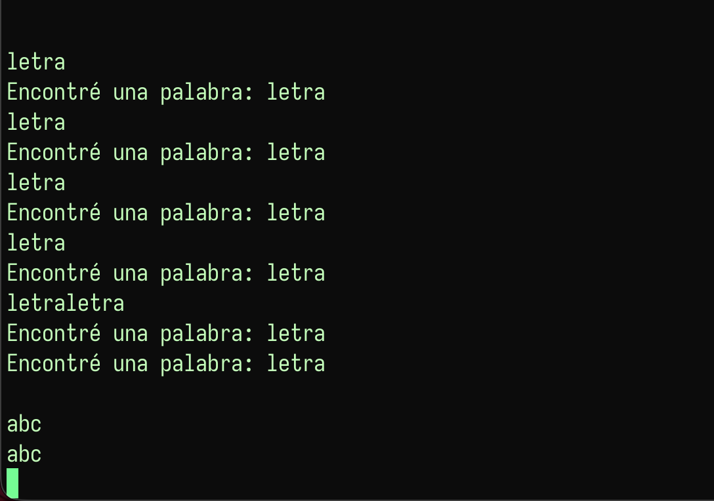

2. ¿Qué ocurre si en la segunda sección se quitan las llaves a las macros? (0.5 pts)

    Regresé la macro `palabra` a `{letra}+` y ahora quité las llaves en las reglas, dejándolas como `espacio`, `digito+` y `palabra`. Pasa algo parecido al inciso anterior: dejan de ser referencias a las macros y se convierten en cadenas literales, por lo que el escáner solo reconoce las palabras `espacio`, `digito` (y `digitoo`, `digitooo`, ..., pues el `+` aplica solo a la `o`) y `palabra`.

    En la imagen se ve que `letra` y `letra+` ya no se reconocen y solo se vuelven a imprimir tal cual; `digito` se reporta como `Encontré un número: digito` aunque no tiene ningún dígito, porque ahora la regla de números es la cadena literal, y `palabra` se reporta como palabra por la misma razón. Al escribir `espacio` no se imprime nada, porque coincide con la regla que ignora los espacios. También aparecen líneas en blanco después de cada mensaje: como la regla `espacio` ya no reconoce el salto de línea, este también se imprime por la regla por defecto. Esto demuestra que las llaves son las que le indican a Flex que debe expandir la macro.

    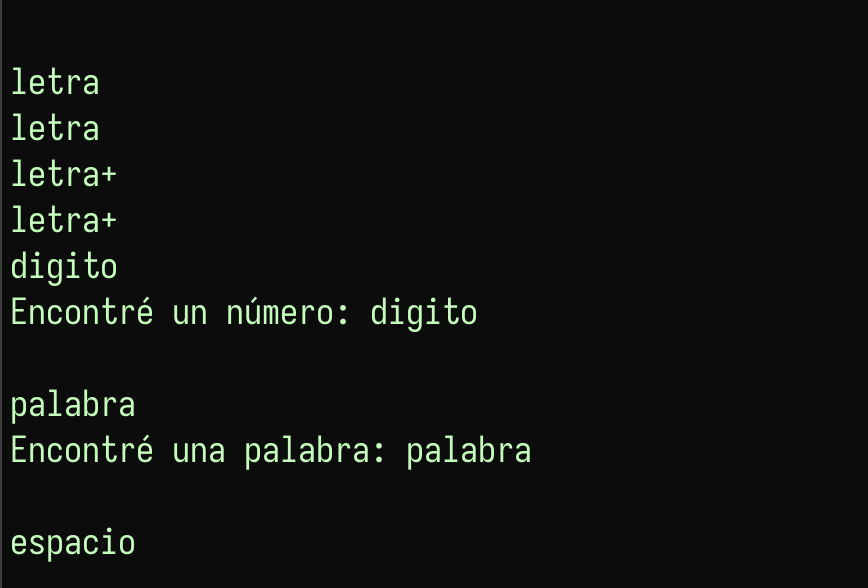

3. ¿Cómo se escribe un comentario en flex? (0.5 pts)

    Con la sintaxis de comentarios de bloque de C, `/* comentario */`, pero depende de la sección en la que se escriba. En mi primer intento (primera imagen) puse el comentario en la columna 0 de la **sección de reglas** y además escribí la regla de números como `{digito+}`, con el `+` dentro de las llaves. Al compilar, Flex marcó `unrecognized rule` en las dos líneas: el comentario lo interpretó como si fuera una expresión regular, y `{digito+}` tampoco es válido porque dentro de las llaves Flex espera únicamente el nombre de una macro.

    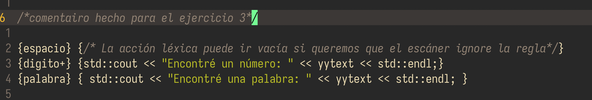

    Para corregirlo (segunda imagen) moví el comentario a la **sección de declaraciones**, justo antes del `%%`, y dejé la regla como `{digito}+`. Así compila sin errores y Flex copia el comentario tal cual a _lex.yy.cc_. En resumen:
    * En la sección de declaraciones el comentario se puede escribir desde la columna 0.
    * En la sección de reglas debe ir con sangría (al menos un espacio o tabulador); en la columna 0 produce `unrecognized rule`.
    * Dentro de las acciones léxicas, de los bloques `%{ ... %}` y en la sección de código de usuario se pueden usar comentarios normales de C++ (`//` y `/* */`), ya que ese código se copia sin modificar a _lex.yy.cc_. Un ejemplo es el comentario dentro de la acción de `{espacio}`, que se ve en ambas imágenes.

    

4. ¿Qué se guarda en yytext? (0.5 pts)

    `yytext` es un apuntador a cadena (`char*`) que contiene el **lexema**, es decir, el texto exacto de la entrada que coincidió con la expresión regular de la regla que se está ejecutando; su longitud se guarda en `yyleng`. No lo declaramos nosotros: en modo C++ es un atributo de la clase `FlexLexer` (declarado en _FlexLexer.h_), y en _lex.yy.cc_ se asigna en la macro `YY_DO_BEFORE_ACTION`, justo antes de ejecutar la acción, haciendo que apunte al inicio del lexema dentro del buffer de entrada y colocando un `'\0'` temporal al final. Por eso su valor cambia con cada token y, si se quiere conservar, hay que copiarlo (p. ej. `std::string s(yytext);`). En las imágenes de las preguntas 1, 2, 5 y 7 se puede ver su contenido: es el texto que aparece después de cada mensaje `Encontré ...:`, ya que las acciones imprimen `yytext`.

5. ¿Qué pasa al ejecutar el programa e introducir cadenas de caracteres y de dígitos por la consola? (0.5 pts)

    Aquí usé el _archivo.ll_ original, sin modificaciones. El programa se queda leyendo de la entrada estándar y, cada vez que se presiona Enter, analiza la línea: por cada secuencia de letras imprime `Encontré una palabra: ...` y por cada secuencia de dígitos `Encontré un número: ...`, mientras que los espacios y saltos de línea se ignoran. En la imagen, al escribir `hola9` el escáner lo dividió en dos tokens, la palabra `hola` y el número `9`, porque `letra` no incluye dígitos y Flex toma la coincidencia más larga posible para cada regla. Con `holaaa mi nombre es 9832882` reconoció cuatro palabras y un número, sin reportar los espacios que las separan. El programa termina hasta recibir fin de archivo (Ctrl+D) o interrumpirlo con Ctrl+C.

    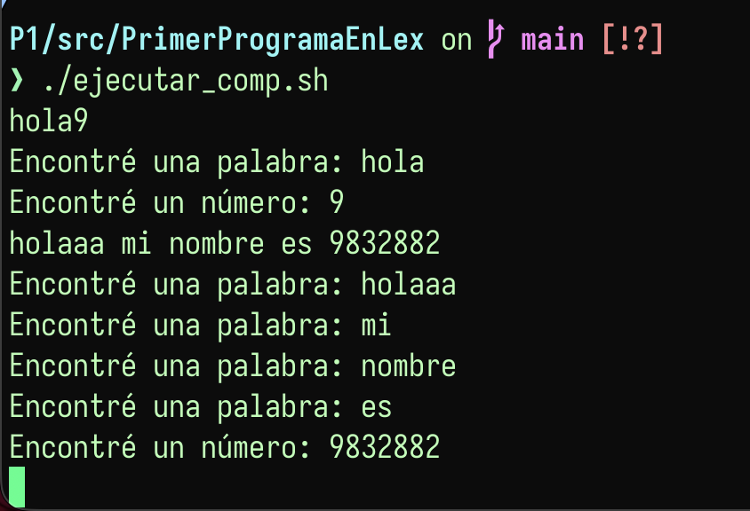

6. ¿Qué ocurre si introducimos caracteres como "\*" en la consola? (0.5 pts)

    También con el _archivo.ll_ original, escribí `*` y después `.`. Como ninguno coincide con las reglas, Flex aplica su **regla por defecto**, que copia el carácter a la salida sin modificarlo (la acción `ECHO`, definida en _lex.yy.cc_ como `LexerOutput(yytext, yyleng)`). Por eso en la imagen cada carácter aparece dos veces: la primera es lo que escribí y la segunda es lo que imprimió el programa, sin ningún mensaje de `Encontré ...`. No se produce ningún error, lo cual muestra que un analizador léxico real debería incluir una regla (p. ej. `.`) para reportar los caracteres no válidos, como se hace en _lexer.ll_ de C_1.

    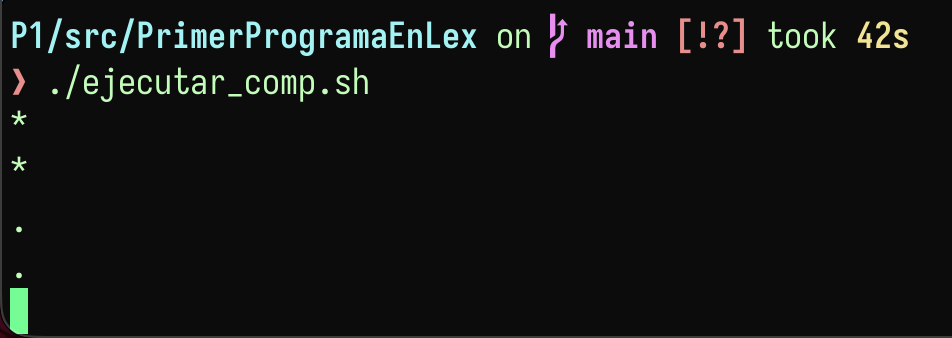

7. Modificar al código anterior en un archivo nuevo, de tal manera que reconozca lo siguiente: (2 pts)
    1. La expresión regular para los hexadecimales en lenguaje C++.
    2. 5 palabras reservadas del lenguaje C++.
    3. Los identificadores válidos del lenguaje C++, con longitud máxima de 32 caracteres (**Sugerencia**: use el operador {m,n}).
    4. Los espacios en blanco.

    Creé el archivo _propio_archivo.ll_ (se compila y ejecuta con _ejecutar_propio_comp.sh_) con las siguientes macros:

    ```lex
    digito [0-9]
    hex 0[xX]({digito}|[a-fA-F])+
    reservadas int|true|class|double|try
    ids [a-zA-Z_][a-zA-Z0-9_]{0,31}
    espacio [ \t\n]
    ```

    * `hex` reconoce un `0x` o `0X` seguido de uno o más dígitos hexadecimales.
    * `reservadas` reconoce las palabras `int`, `true`, `class`, `double` y `try`. Al escribirla descubrí que no debe haber espacios alrededor de `|`, porque el espacio termina la expresión regular y Flex marca `unrecognized rule`.
    * `ids` reconoce un primer carácter que es letra o guion bajo, seguido de hasta 31 letras, dígitos o guiones bajos, para un máximo de 32 caracteres.
    * `espacio` reconoce espacios, tabuladores y saltos de línea, que se ignoran.

    También conservé la regla `{digito}+` de _archivo.ll_ para los números decimales. El orden de las reglas es importante: `{reservadas}` va antes de `{ids}`, porque cuando dos reglas reconocen la misma longitud gana la primera, y así `int` no se reporta como identificador. Al principio había escrito dos reglas `{hex}`, y Flex advirtió `rule cannot be matched` para la segunda, ya que nunca podría ganarle a la primera.

    En la imagen se ve que `int` y `class` se reconocen como palabras reservadas; `_`, `i` y `_x` como identificadores; `93822` como número y `0xabc` como hexadecimal (aquí `{digito}+` solo alcanzaría el `0`, así que gana `{hex}` por ser la coincidencia más larga). El carácter `:` no pertenece a ninguna regla, por lo que solo se vuelve a imprimir tal cual.

    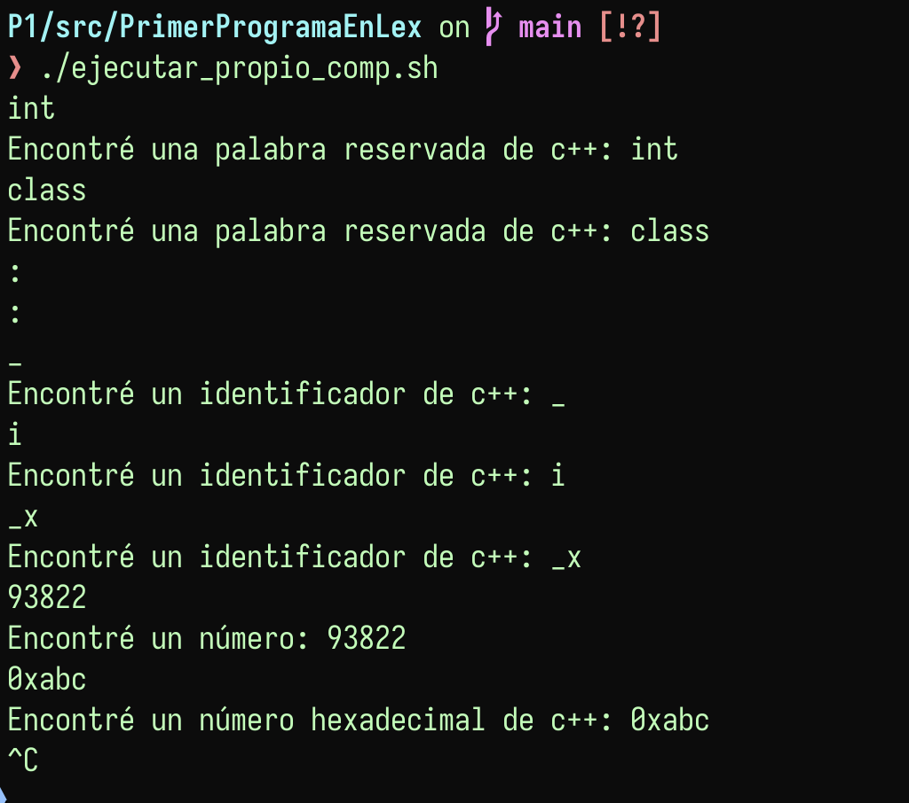

---

## Analizador léxico para el lenguaje C_1


### Estructura del directorio
```c++
p2
├── README.md
└── src
    ├── C_1
    │   ├── Lexer.hpp //archivo de cabecera del analizador
    │   ├── lexer.ll //definición del analizador léxico en Flex 
    │   ├── main.cpp //contiene la función principal del programa
    │   ├── prueba //archivo de entrada para el analizador léxico
    │   └── tokens.hpp //definición de tokens
    └── Primer programa en Lex
```

### Uso

#### Compilación

```bash
$ cd src/
$ flex++ lexer.ll
$ g++ Lexer.cpp main.cpp -o compiler
```

#### Ejecución

```bash
$ ./compiler prueba
```


#### Salida esperada
```
12, int
15, float
11, if
14, else
13, while
12, int
16, 12345
16, 1.2e6
10, a1
10, a_23
10, ___
10, id2
10, if3
10, while4
10, _b
9, ;
8, ,
6, (
7, )
12, int
7, )
10, a
10, _qbc
```


#### Ejercicios

8. Describir el conjunto de terminales y la expresión regular que reconoce a cada uno  en _lexer.ll_. (2 pts)

    En _lexer.ll_ definí los terminales que aparecen en _tokens.hpp_. Para los que tienen una forma variable usé macros en la primera sección, y para los que son una cadena fija escribí la cadena literal directamente en la regla:

    | Terminal | Token | Expresión regular |
    |----------|-------|-------------------|
    | Suma, resta, multiplicación, división | `MAS` (1), `MENOS` (2), `MUL` (3), `DIV` (4) | `"+"`, `"-"`, `"*"`, `"/"` |
    | Asignación | `ASIG` (5) | `"="` |
    | Paréntesis | `LPAR` (6), `RPAR` (7) | `"("`, `")"` |
    | Coma y punto y coma | `COMA` (8), `PYC` (9) | `","`, `";"` |
    | Identificadores | `ID` (10) | `ids ({letra}\|_)({letra}\|{DIG}\|_)*` |
    | Palabras reservadas | `IF` (11), `INT` (12), `WHILE` (13), `ELSE` (14), `FLOAT` (15) | `"if"`, `"int"`, `"while"`, `"else"`, `"float"` |
    | Números enteros y flotantes | `NUMERO` (16) | `numero {DIG}+(\.{DIG}+)?([eE][+-]?{DIG}+)?` |
    | Espacios en blanco (se ignoran) | — | `espacio [ \t\n\r]` |

    con las macros auxiliares `DIG [0-9]` y `letra [a-zA-Z]`. La expresión de `numero` acepta una parte entera obligatoria, una parte decimal opcional y un exponente opcional con signo, por lo que reconoce tanto `12345` como `1.2e6`. Los identificadores empiezan con letra o guion bajo, así que `___` y `_b` son válidos, pero un lexema que empieza con dígito no.

    Las palabras reservadas van en reglas separadas (y no en una sola macro) porque cada una debe regresar un token distinto, y van **antes** de `{ids}`: cuando dos reglas reconocen la misma longitud gana la primera, por eso `int` sale como `INT` y no como `ID`. En cambio `if3` o `while4` salen como identificadores porque Flex siempre toma la coincidencia más larga. Como el archivo usa `%option case-insensitive`, las palabras reservadas también se reconocen en mayúsculas (`WHILE`, `IF`). Al final dejé la regla `.` que imprime `ERROR LEXICO` para cualquier carácter que no pertenezca al lenguaje.

9. Generar acciones léxicas para cada terminal de nuestro lenguaje en _Lexer.cpp_, de modo que se muestre en pantalla la salida esperada con el archivo _prueba_. (2 pts)

    Al principio, al ejecutar el analizador con _prueba_ solo se imprimía `ERROR LEXICO` por cada carácter, porque la única regla era `.` y ninguna acción regresaba un token, así que `yylex()` recorría todo el archivo y regresaba 0. Para generar la salida esperada, cada acción léxica ahora hace `return` del token correspondiente, por ejemplo:

    ```lex
    "int" { return INT; }
    {numero} { return NUMERO; }
    {ids} { return ID; }
    ```

    Gracias a `%option yyclass="C_1::Lexer"`, Flex copia estas acciones dentro del método `C_1::Lexer::yylex()` en _Lexer.cpp_, por lo que los nombres de _tokens.hpp_ se pueden usar directamente. En _main.cpp_ el ciclo pide tokens hasta recibir 0 (fin de archivo) e imprime el número de token junto con el lexema usando `YYText()`, que regresa el mismo contenido de `yytext`. Los espacios solo se ignoran, sin `return`, por lo que no aparecen en la salida. En la imagen se ve la ejecución de `./compiler prueba`, que coincide línea por línea con la salida esperada del enunciado (también lo comprobé con `diff`). Ahí se nota el orden de las reglas: `if` y `while` salen como palabras reservadas (11 y 13), pero `if3` y `while4` salen como identificadores (10) porque la coincidencia de `{ids}` es más larga; `12345` y `1.2e6` salen como `NUMERO` (16), y en `)a` el paréntesis y la `a` se separan en dos tokens distintos.

    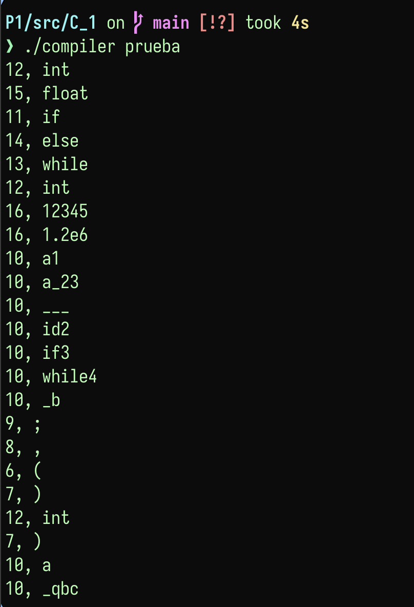

10. Crear un _Makefile_. (1 pt)

    Creé el archivo _src/C_1/Makefile_ con las siguientes reglas:

    * `make` (o `make all`): ejecuta `flex++ lexer.ll` para generar _Lexer.cpp_ y luego `g++ Lexer.cpp main.cpp -o compiler`.
    * `make run`: compila si hace falta y ejecuta `./compiler prueba`.
    * `make clean`: borra los archivos generados (_Lexer.cpp_ y _compiler_).

    Cada objetivo declara sus dependencias, por lo que `make` solo rehace lo que cambió: si se modifica _lexer.ll_ se vuelve a generar _Lexer.cpp_ y después el ejecutable, pero si todo está al día responde `Nothing to be done`. Un detalle importante es que las líneas de comandos deben empezar con un tabulador y no con espacios; si no, `make` marca el error `missing separator`.

---
#### Extras

11. Documentar el código. (0.25pts)

    Agregué comentarios a todos los archivos del analizador:

    * _lexer.ll_: un encabezado que explica qué hace el analizador, el propósito de cada `%option` y de las macros `numero` e `ids`, y un comentario por cada grupo de reglas (operadores, puntuación, palabras reservadas y errores). En la sección de reglas los comentarios van con sangría, porque en la columna 0 Flex los tomaría como una expresión regular (pregunta 3).
    * _Lexer.hpp_: qué hereda la clase `Lexer` de `yyFlexLexer` y qué regresa `yylex()`.
    * _tokens.hpp_: que las constantes son los códigos de los terminales y que el 0 queda reservado para el fin de archivo.
    * _main.cpp_: qué hace el programa, cómo se abre el archivo de entrada y la condición de paro del ciclo.
    * _Makefile_: qué hace cada objetivo.

12. Proponer 4 archivos de prueba nuevos, 2 válidos y 2 inválidos. (0.25pts)

    Agregué cuatro archivos en _src/C_1/_, que se ejecutan con `./compiler <archivo>`:

    * **_prueba_valida1_**: declaraciones y expresiones aritméticas con los cuatro operadores, asignación, paréntesis y un flotante con exponente negativo. En la imagen se ve que todos los lexemas se reconocen sin errores; por ejemplo, `2.5e-3` sale completo como un solo `NUMERO` (16) gracias a la parte `[+-]?` del exponente, y `+`, `-`, `*` y `/` salen con sus tokens 1 a 4.

    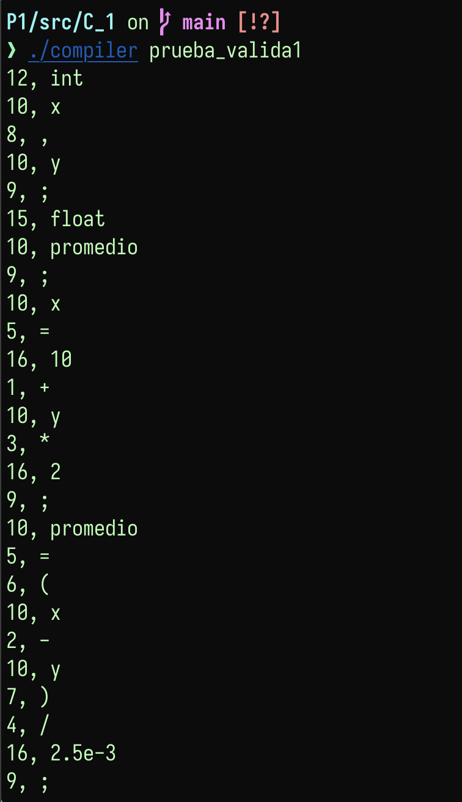

    * **_prueba_valida2_**: palabras reservadas en mayúsculas, identificadores con guion bajo y el flotante `3.1416E2`. En la imagen se ve el efecto de `%option case-insensitive`: `WHILE`, `IF` y `ELSE` se reconocen como los tokens 13, 11 y 14 aunque estén en mayúsculas, y `yytext` conserva el texto tal como se escribió. También `contador_1` y `_temp` salen como identificadores y `3.1416E2` como número, con la `E` mayúscula.

    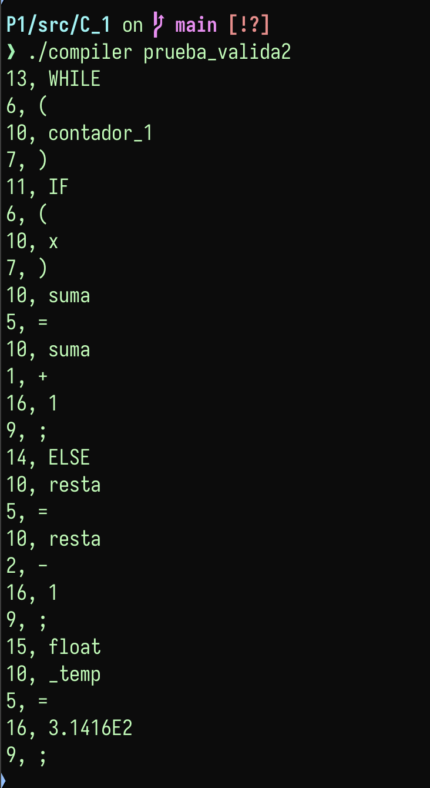

    * **_prueba_invalida1_**: contiene `$`, `#` y `!`, que no pertenecen al lenguaje. En la imagen se ve que cada uno produce `ERROR LEXICO` seguido del carácter, y que en `$precio` solo falla el `$`: `precio` sí se reconoce como identificador.

    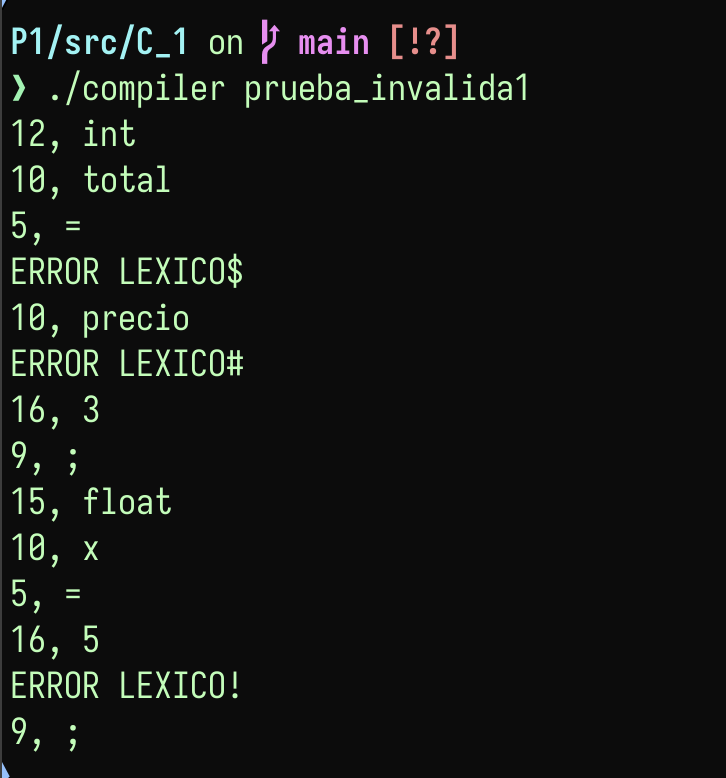

    * **_prueba_invalida2_**: usa símbolos de otros lenguajes que C_1 no tiene: `>=`, llaves y una cadena entre comillas. En la imagen se ve que `>` marca error pero el `=` que le sigue sí se reconoce como `ASIG` (5), que las dos llaves marcan error y que en `"hola"` solo fallan las comillas, mientras que `hola` sale como identificador.

    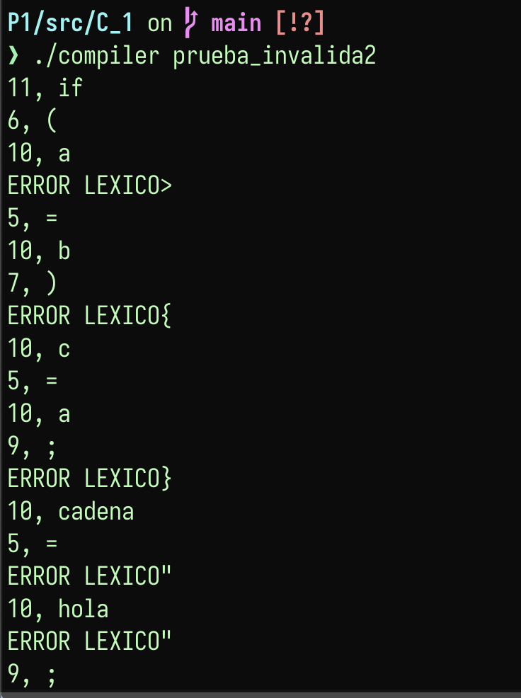

    En ambos archivos inválidos el analizador no se detiene al primer error: reporta el carácter y continúa con el resto de la entrada, porque la acción de la regla `.` solo imprime el mensaje y no hace `return`.


